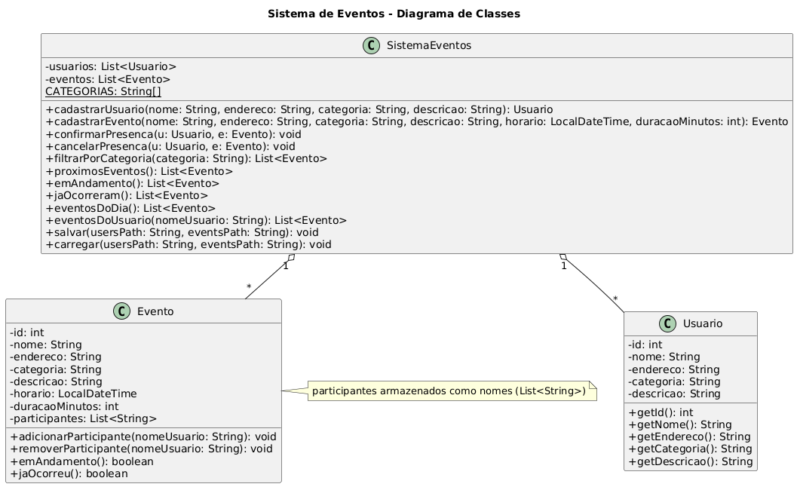

# Sistema de Eventos (Console – Java)

Protótipo em **Java (POO)** para cadastro e notificação de eventos, com persistência simples em arquivo.  
O projeto roda em **console** e está preparado para uso no **VS Code**.

---

## Requisitos
- **JDK 24+**
- **Visual Studio Code** com *Extension Pack for Java* (ou outra IDE de sua preferência)

---

## Como executar

### Via VS Code
1. Abra a pasta do projeto no VS Code.
2. Abra `Main.java` e clique em **Run** acima do método `main`.

### Via Terminal
```bash
# compilar (na pasta do projeto)
javac *.java

# executar
java Main
```

> **Formato de data aceito:** `dd/MM/yyyy HH:mm` (ex.: `25/12/2025 20:30`)

---

## Funcionalidades
- Cadastro de **Usuários** e **Eventos**  
  (evento com **nome, endereço, categoria, horário, descrição** e **duração** em minutos)
- **Categorias delimitadas**: `Festa`, `Esporte`, `Show`, `Cultural`, `Tecnologia`, `Outros`
- **Confirmação** e **cancelamento** de presença por usuário/evento
- **Listagem por categoria**
- **Próximos eventos**, **eventos em andamento** e **já ocorridos**
- **Eventos do dia** (exibidos ao iniciar)
- **Edição e exclusão** de **eventos** e **usuários** (prompts permitem **ENTER** para manter valor atual)
- **Persistência** em `users.data` e `events.data` (CSV simples com escape de `;`)

---

## Menu (opções do programa)
```
1) Cadastrar usuário
2) Cadastrar evento
3) Listar eventos
4) Filtrar por categoria
5) Confirmar presença em evento
6) Ver próximos eventos
7) Ver eventos EM ANDAMENTO
8) Meus eventos + Cancelar participação
9) Editar evento
10) Excluir evento
11) Editar usuário
12) Excluir usuário
13) Salvar agora
14) Recarregar do arquivo
15) Buscar eventos por endereço
16) Eventos na minha região (por usuário)
17) Exportar CSV - todos os eventos
18) Exportar CSV - meus eventos (por usuário)
19) Exportar CSV - todos os usuários
20) Ver eventos já ocorridos
0) Sair (salva automaticamente)
```

---

## Estrutura do projeto
```
.
├── Evento.java
├── Main.java
├── SistemaEventos.java
├── Usuario.java
├── Utils.java
├── diagram.puml
├── docs/
│   └── SistemaEventos.png
└── .gitignore
```

---

## Diagrama de Classes (UML)
Arquivo-fonte: `diagram.puml` (PlantUML).  
Você pode visualizar no VS Code (extensão **PlantUML**) ou gerar a imagem em `docs/SistemaEventos.png`.

<p align="center">
  
</p>

---

## Persistência de dados
- `users.data` – usuários  
- `events.data` – eventos (inclui lista de participantes)
- Os `.data` estão ignorados via `.gitignore`. Se precisar versioná-los, remova `*.data` do `.gitignore`.

---

## Exemplo de execução
```text
=== Eventos de HOJE ===
Nenhum evento para hoje.

===== MENU =====
1) Cadastrar usuário
2) Cadastrar evento
3) Listar eventos
...
```

---

## Roadmap
- Busca por cidade/bairro
- Exportar CSV/relatórios
- Organização em pacotes (MVC)
- Testes automatizados

---

## Como contribuir
1. Crie uma *branch*: `git checkout -b feature/sua-feature`
2. Faça commits pequenos e claros
3. `git push -u origin feature/sua-feature`
4. Abra um **Pull Request** no GitHub
